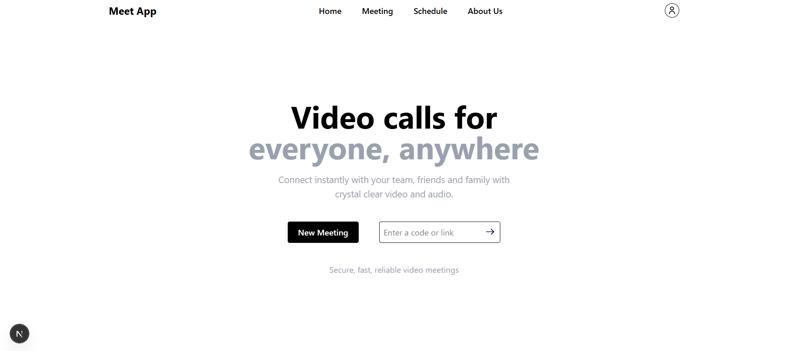

# Meet App - Real-Time Video Conferencing

Meet App is a full-stack, real-time video conferencing application built with a modern, scalable architecture. Designed for seamless communication, it provides high-quality video and audio streaming in a collaborative environment.

## Key Features

This application is engineered to deliver a robust and interactive user experience.

*   **Real-Time Communication**: High-quality, low-latency video and audio streaming powered by Mediasoup (SFU).
*   **Interactive UI**: A responsive and intuitive user interface built with Next.js and Tailwind CSS.
*   **Scalable Backend**: Decoupled architecture with separate HTTP and WebSocket servers for optimal performance.
*   **Secure Access**: Robust authentication system using JWT to ensure secure user access.
*   **Room-Based Conferencing**: Create and join unique rooms for private or group meetings.

## Tech Stack

The project leverages a modern, type-safe, and scalable technology stack organized within a Turborepo monorepo.

*   **Frontend**: Next.js, React, Redux Toolkit
*   **Styling**: Tailwind CSS
*   **Backend (HTTP)**: Node.js, Express.js
*   **Backend (Real-Time)**: WebSockets, Mediasoup
*   **Database**: MongoDB (Mongoose)
*   **Infrastructure**: Turborepo, pnpm

## 🏛️ Architecture

The application is built on a decoupled, multi-service architecture to ensure scalability and maintainability.

*   **Monorepo Structure**: The project is organized in a Turborepo monorepo containing distinct services:
    *   `apps/frontend`: The Next.js client application.
    *   `apps/http-backend`: RESTful API for authentication and data persistence.
    *   `apps/ws-backend`: WebSocket server handling real-time signaling and media routing.
*   **SFU Architecture**: Utilizes Mediasoup as a Selective Forwarding Unit (SFU) to efficiently route media streams between participants, reducing bandwidth usage compared to Mesh architectures.
*   **Shared Packages**: Reusable code for UI components, database models, and configurations are maintained in the `packages/` directory.

## **Overview**


## **Docker Installation**

Follow these instructions to get a local copy up and running for development.

1. **Clone the repository:**  
   ```bash
   git clone https://github.com/alok13fe/Meet-App.git 
   cd '.\Meet App\'
   ```

2. **Set up environment variables:**  
   ```bash
   cp .env.example .env
   ```

   *Fill in the .env file with your database credentials, JWT secret, and other necessary variables.*  

3. **Run the Docker containers:**  
   ```bash 
   docker-compose up  
   ```

Open http://localhost:3000 in your browser to view the project.

## **Contact**
For queries or feedback, please contact [Alok](mailto:anandkumar19d@gmail.com).

---